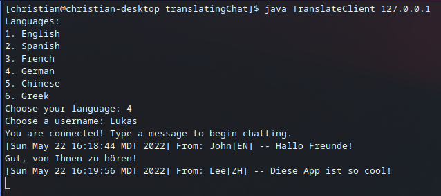
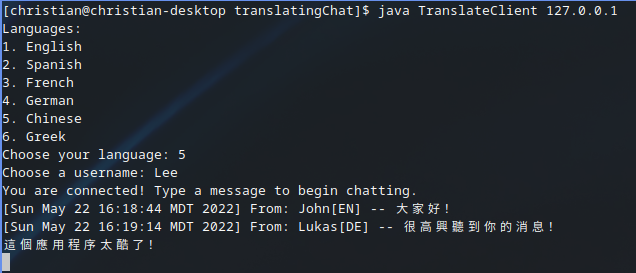

In order to build the application you must have Java version 14 or later.

There are two different files that you need to run, TranslateServer and TranslateClient. I will refer to these as Server and Client throughout the rest of this document.

Since I am only supplying the source code, you will need to build and run the application yourself. First you will need to start the server.

Building and Running

	In a terminal navigate to the directory that has the Java source files in it. 

	Compile the files by running the command 'javac TranslateServer.java TranslateClient.java' without the quotes.

	Once this is done you can start the server by running the command 'java TranslateServer' without quotes. 

	After the server is running you can start up as many clients as you would like by using the command 'java TranslateClient <ip-of-server>' without quotes.  
	This starts the server on port 1024 so it shouldn't need sudo priviledges to run. 

Using the Application
	
	When you startup the application you will be asked what language you would like to send and receive messages in. You can select a language by typing the corresponding letter for the language you want.
	
	After you select a language, you will be asked for a username, enter whatever you want to be known as and click enter.

	Once this is done you will be all setup! Enter a message to say hi to your friends.

Pictures:

